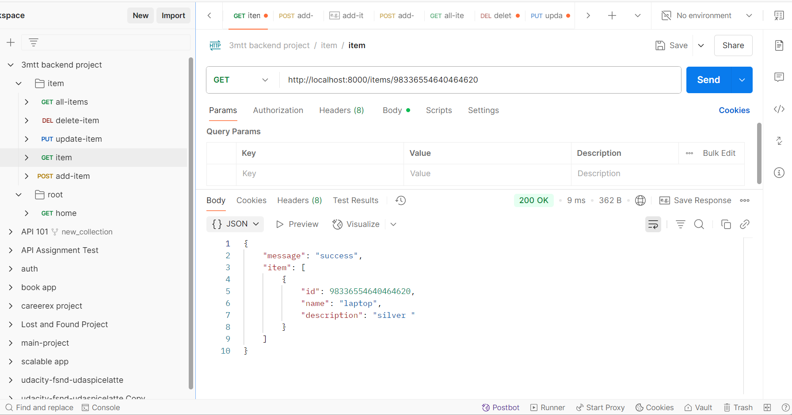
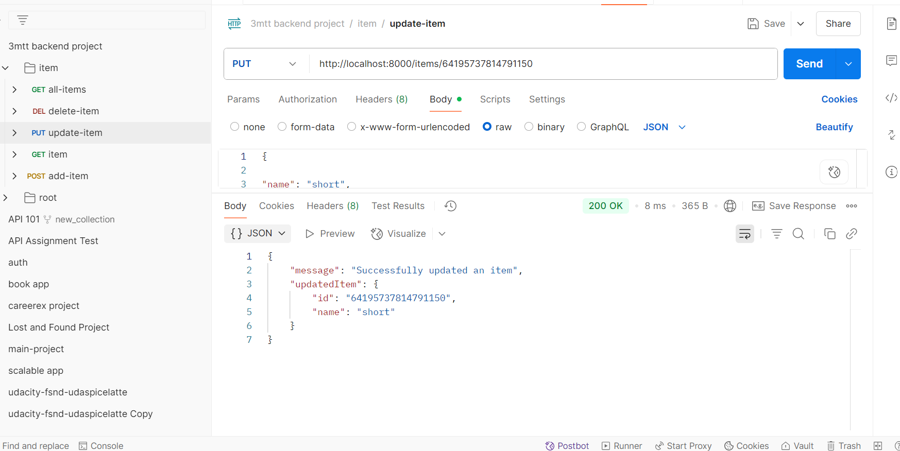

# Setup Instruction - Creating and running the server

1. Install node and verify if installed by checking the verison using node -v.

2. Install npm using npm init --y to give use default name as the project name or npm init and follow prompt to provide other detils and assign project name. This automatically create package.json file which contains all project dependencies.

3. Install express using npm i express or npm install express, this creates the node_modules and package-lock.json.

4. Install nodemon using npm i nodemon or npm install nodemon, this allows auto restart of server after each udpate of code.


5. Edit the package.json file  to include "start": "node index.js", "dev" : "nodemon index.js" within the scripts as shown below. This offers the options to run the app using either:  npm run dev for nodemon or npm run start. Ensure file name containing server is the same as that used in the scripts otherwise app won't run.


```json 

 "scripts": {
    "test": "echo \"Error: no test specified\" && exit 1",
    "start": "node index.js",
    "dev" : "nodemon index.js"
  },

```
6. Run the server using npm run dev or npm run start


# API Documentation - Endpoints and how to use the APIs

Postman collection documentation link

https://documenter.getpostman.com/view/20399348/2sB2xCh9Vh


1. Get welcome message 

GET http://localhost:8000/

```json 
curl --location --request GET 'http://localhost:8000/'

This is a testing endpoint used for testing the app and uses get request to return the message 'Hello World'

```


2. Get all items 

GET http://localhost:8000/items


```json

curl --location --request GET 'http://localhost:8000/items'


This  uses get request and displays list all items in the datastore with success message and code (200) and corresponding , example of response

```json 
{
    "message": "success",
    "allItems": [
        {
            "id": 28613543449174840,
            "name": "gown",
            "description": "blue "
        },
        {
            "id": 81961863166019330,
            "name": "laptop",
            "description": "silver "
        }
    ]
}

```


3. Add item

POST http://localhost:8000/items

```json

curl --location --request POST 'http://localhost:8000/items' \
--header 'Content-Type: application/json' \
--data-raw '{
    "name": "gown",
    "description": "blue"
}'


This endpoin uses post request and allows addition of an item to the datastore, the name and discription of the item must be provided while the item id is automatically assiigned upon submission of the request. Success message is received as well as the item added. If any required data is not provided , it raises error and displays the code 404 with error message.

example of request and response 

```json

Request : {
    
    "name": "gown",
    "description": "blue "
}


Response: {
    "message": "Succesfully added item",
    "newItem": {
        "id": 28613543449174840,
        "name": "gown",
        "description": "blue "
    }
}


```


4. Get an item using its id 
This uses get to send request to http://localhost:8000/items/id , the id of the item is passed as param to the endpoint. It returns success message and code with the item with the given id but If an item id is not provided or item not in datastore, error message and code 400 is diaplayed. example of request and response is shown below;

```json 

curl --location --request GET 'http://localhost:8000/items/28613543449174840'


Request 


```json 
Response: 
{
    "message": "success",
    "item": [
        {
            "id": 81961863166019330,
            "name": "laptop",
            "description": "silver "
        }
    ]
}

```



5. Delete an item using its id 

DELETE http://localhost:8000/items/:id

```json
curl --location --request DELETE 'http://localhost:8000/items/28613543449174840'

```

This uses the request method delete to send request to http://localhost:8000/items/id with the id of the item which returns the item deleted and sucess message and code (200) if successful. If item is not found, an erron message and code is disaplayed. example 

Request

```json

Response

{
    "message": "successfully deleted item",
    "deleteItem": {
        "id": "28613543449174840",
        "name": "short"
    }
}

```


6. Update an item

PUT http://localhost:8000/items

```json

curl --location --request PUT 'http://localhost:8000/items/28613543449174840' \
--header 'Content-Type: application/json' \
--data-raw '{
    "name": "short",
    "description": "yellow"
}

```


The method put is used to send request to http://localhost:8000/items/28613543449174840, with the id of the item to be updated. This updates the item in the datastore with the provided value(s) and display success message with code 200  and returns the item updated if successfull. Otherwise, sends error message and the code 400. 

item in datastore before update

```json 

 {
     "id": 28613543449174840,
     "name": "gown",
     "description": "blue "
},


Request 

{

"name": "short",
"description": "yellow"

}


Response

{
    "message": "Successfully updated an item",
    "updatedItem": {
        "id": "28613543449174840",
        "name": "short"
    }
}

```




